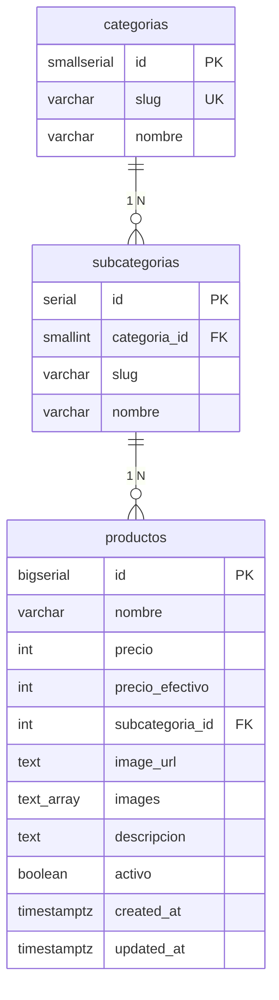

# Análisis del Proyecto — Repositorio Grupo 2

**AGUSTINA · Trabajo Final — Base de Datos Avanzada**

Integrantes: Conforti Angelo · Contreras Facundo · Perez Juan Ignacio · Romero Tomas · Vergara Juan Ignacio

Referencia operativa académica: `npm run dev` → http://127.0.0.1:5173/  
Demo histórica en Vercel (infra anterior): [https://web-agustina.vercel.app/](https://web-agustina.vercel.app/)

---

## Resumen general

El repositorio es una **aplicación full-stack de catálogo e-commerce** orientada a la materia Base de Datos Avanzada:

1. **PostgreSQL** (Railway u otro host) con esquema versionado, migraciones Sequelize, seeders de volumen y vista `v_productos_catalogo`.
2. **Backend local Node.js** (`server.js`) que expone API REST bajo `/api/*`, sirve el frontend estático y concentra la persistencia en la base relacional.
3. **Frontend vanilla** (HTML/CSS/JS) con catálogo, detalle, carrito (`localStorage`), panel admin y página de métricas (`metricas.html`).
4. **Módulos académicos** documentados: índices con `EXPLAIN`, backup/restore con `pg_dump`/`pg_restore`, transacciones ACID en CRUD y seeds, seguridad de conexión y consultas parametrizadas.

Respecto al análisis anterior (frontend + Supabase/Workers externos), el pull actual **integra la capa de datos dentro del repo**: ya no depende de un Worker ni de Supabase para el flujo de entrega local. El README describe setup, API, temas de la cursada y scripts npm de punta a punta.

---

## Stack tecnológico


| Capa | Tecnología | Estado |
|------|------------|--------|
| Base de datos | PostgreSQL (Railway) | ✅ |
| ORM / migraciones | Sequelize 6 + sequelize-cli | ✅ |
| Backend | Node.js 18+ (`server.js`, HTTP nativo) | ✅ |
| Frontend | HTML5, CSS3, JavaScript vanilla | ✅ |
| Animaciones | GSAP 3 + ScrollTrigger | ✅ |
| Imágenes | Cloudinary (upload desde admin) | ✅ |
| Backup | `lib/backup/` → `pg_dump` / `pg_restore` | ✅ |
| Tests | Node built-in (`node --test`) | ✅ |
| Deploy académico | Local (`npm run dev`) | ✅ |
| Deploy histórico | Vercel (puede no reflejar API local) | ⚠️ |


---

## Estructura del repositorio


| Ruta | Rol |
|------|-----|
| `server.js` | Servidor local + rutas `/api/*` + archivos estáticos |
| `lib/catalog/product-service.js` | CRUD con transacciones y SQL parametrizado |
| `lib/backup/` | Backup, restore, integridad SHA-256, retención |
| `scripts/db-backup-cli.js` | CLI npm (`db:backup`, `db:backup:restore`, etc.) |
| `scripts/import-demo-products.js` | Import opcional desde `data/productos-demo.json` |
| `scripts/run-explain-c.js` | Genera `informe/seccion_C.md` |
| `db/schema.sql` | DDL canónico (tablas + vista) |
| `db/migrations/` | Esquema inicial + índices de catálogo |
| `db/models/` | Modelos Sequelize (`Categoria`, `Subcategoria`, `Producto`) |
| `db/seeders/` | Taxonomía + bulk `[seed-exp]` para EXPLAIN |
| `db/experiments/` | Scripts SQL reproducibles (baseline → índices → auditoría) |
| `config/database.js` | Conexión Postgres, SSL Railway |
| `js/config.js` | `API_URL = "/api"` (relativo al servidor local) |
| `js/catalog.js`, `js/product.js`, `js/cart.js` | Frontend público |
| `js/admin.js`, `css/admin.css`, `admin.html` | Panel admin |
| `js/metricas.js`, `metricas.html` | Visualización de métricas |
| `docs/BACKUP_RESTORE.md` | Guía operativa de backup |
| `informe/seccion_C.md` | EXPLAIN ANALYZE con datos reales (15k filas) |
| `informe/seccion_D.md` | Planes y disco — **plantilla sin completar** |
| `informe/seccion_E.md` | Optimización de índices — redactada, checklist pendiente |
| `tests/backup.test.js` | Tests del módulo backup |
| `tests/transactions.test.js` | Tests de rollback/commit en catálogo |
| `data/productos-demo.json` | Catálogo demo (import opcional) |
| `README.md` | Documentación completa de setup y temas de cursada |


---

## Modelo de datos

Esquema en `db/schema.sql`, aplicado vía migración `20250511120000-init-agustina-schema.js`.



La vista `v_productos_catalogo` expone `name`, `price`, `cat`, `sub` y el resto de campos que consume el frontend.

### API REST local (`server.js`)


| Método | Ruta | Descripción |
|--------|------|-------------|
| `GET` | `/api/productos` | Catálogo público (`activo = true`) |
| `GET` | `/api/producto?id=` | Detalle |
| `GET` | `/api/admin/productos` | Listado admin (incluye inactivos) |
| `POST` | `/api/guardar-producto` | Alta |
| `PATCH` | `/api/producto` | Actualización parcial |
| `DELETE` | `/api/producto` | Eliminación |
| `GET` | `/api/metricas` | Datos para `metricas.html` |

Sin `DATABASE_URL` la API responde **503** con mensaje explícito.

---

## Cumplimiento de temas — Trabajo Final

Requisito: **≥ 4 temas** implementados y explicados.


| Tema | Estado | Evidencia en el repo |
|------|--------|---------------------|
| **Índices** | ✅ Completo | Migración `20250520130000-add-catalog-indexes.js`, `db/experiments/`, `informe/seccion_C.md`, `informe/seccion_E.md` |
| **Backup & Restore** | ✅ Completo | `lib/backup/`, `scripts/db-backup-cli.js`, `docs/BACKUP_RESTORE.md`, `tests/backup.test.js`, scripts npm `db:backup*` |
| **Transacciones** | ✅ Completo | `lib/catalog/product-service.js` (`sequelize.transaction`), seeders, `import-demo-products.js`, `tests/transactions.test.js` |
| **ORM / Sin ORM** | ✅ Completo | Modelos Sequelize + SQL crudo parametrizado en servicio, migraciones y experimentos |
| **Seguridad** | ⚠️ Parcial | `.env`, SSL (`config/database.js`), `bind`/`$1` en API y seeders, constraints DDL; admin sin auth server-side |
| **Particionado** | ❌ No implementado | Tabla `productos` sin partición |
| **NoSQL** | ❌ No usado | Solo PostgreSQL; **falta documentar la decisión** en informe/README |


### Conteo para la entrega

El grupo cubre **5 temas** de forma defendible (índices, backup/restore, transacciones, ORM/SQL, seguridad de capa DB), **superando el mínimo de 4**. Particionado y NoSQL quedan como temas opcionales o pendientes de justificación escrita.

---

## Detalle por tema implementado

### 1. Índices

| Índice | Tipo | Columnas | Condición | Query |
|--------|------|----------|-----------|-------|
| `idx_productos_subcategoria_id` | B-tree | `subcategoria_id` | — | JOIN FK |
| `idx_productos_activos` | B-tree parcial | `(subcategoria_id, created_at DESC)` | `WHERE activo = TRUE` | Q1 — catálogo por categoría |
| `idx_productos_created_at_desc` | B-tree | `created_at DESC` | — | Q2 — badge NUEVO |

Resultados (`informe/seccion_C.md`, 15 000 productos):

- **Q2:** mejora clara — de `Sort` (~2,5 ms) a `Index Scan` (~0,02 ms).
- **Q1:** el planner aún prefiere `Sort` en memoria; conviene analizar en sección D o re-ejecutar con más volumen / `ANALYZE`.
- **Q3:** mejora leve; el cuello sigue en el join sin filtro `activo`.

Reproducir: `npm run db:setup` → `db/experiments/` o `npm run informe:c`.

### 2. Backup & Restore

- Comandos: `npm run db:backup`, `db:backup:list`, `db:backup:restore -- <id>`, `db:backup:validate`, `db:backup:prune`.
- Formato custom (`.dump`) o plain comprimido; manifiesto JSON con checksum SHA-256.
- Política de retención configurable (`BACKUP_RETENTION_COUNT`, `BACKUP_RETENTION_DAYS`).
- Restore con confirmación interactiva (`RESTORE`) o `--force` para scripts.
- Requisito externo: binarios `pg_dump`, `pg_restore`, `psql` en PATH.

### 3. Transacciones ACID

Patrón central en `lib/catalog/product-service.js`:

```javascript
return db.sequelize.transaction(async (transaction) => {
  const subcategoriaId = await resolveSubcategoriaId(cat, sub, transaction);
  await queryCatalog(`INSERT INTO productos (...) VALUES (...)`, { bind, transaction });
  return fetchProductFromView(id, transaction);
});
```

| Flujo | Operaciones atómicas |
|-------|----------------------|
| `createProduct` | Resolver FK + `INSERT` |
| `updateProduct` | `SELECT … FOR UPDATE` + re-resolución FK + `UPDATE` dinámico |
| `deleteProduct` | Bloqueo de fila + `DELETE` |
| Seed taxonomía / bulk | Inserts/deletes encadenados |
| Import demo JSON | Importación completa o rollback |

Tests verifican rollback ante subcategoría inexistente y commit en operaciones válidas.

### 4. ORM y SQL crudo

- **ORM:** modelos Sequelize con asociaciones en `db/models/`.
- **Sin ORM:** `product-service.js` consulta la vista con SQL y parámetros `$1`; migraciones leen `schema.sql`; experimentos en `db/experiments/` son SQL puro.
- Contraste explícito y documentado en README — válido para la cátedra.

### 5. Seguridad

**Implementado:**

- Credenciales en `.env` (ignorado por git); `.env.example` documentado.
- TLS hacia Railway (`DATABASE_SSL`).
- Consultas parametrizadas con `{ bind: [...] }` en servicio de catálogo, seeders e import demo.
- Integridad referencial (`ON DELETE RESTRICT`), `CHECK` en slugs y precios.

**Pendiente / débil:**

| # | Problema |
|---|----------|
| 1 | Contraseña admin en cliente: `ADMIN_PWD = "1234"` en `js/admin.js` |
| 2 | Rutas `/api/admin/*` sin autenticación server-side |
| 3 | Credenciales Cloudinary expuestas en el frontend (upload directo) |
| 4 | Sin rate limiting ni validación de origen en la API local |

---

## Temas no implementados

### Particionado

No hay partición por rango/lista en `productos`. Con ~15k–50k filas de experimento el beneficio es marginal; solo tendría sentido como **quinto tema** si el informe lo justifica con proyección de crecimiento o archivado por `created_at`.

### NoSQL — decisión pendiente de documentar

Arquitectura actual:

- **PostgreSQL** para datos relacionales normalizados (catálogo, precios, taxonomía).
- **Cloudinary** para blobs/imágenes (CDN, no base documental).
- **localStorage** para carrito efímero del cliente (no persistencia de negocio).

**Decisión recomendada para el informe:** no se adoptó MongoDB/Redis/etc. porque el dominio es relacional, el volumen es acotado y las URLs de imágenes son atributos escalares o arrays en Postgres. Falta redactar esta sección explícitamente (README o informe final en PDF).

---

## Estado del informe académico


| Sección | Responsable | Estado | Pendiente |
|---------|-------------|--------|-----------|
| C — EXPLAIN | Persona C | ✅ Generada (15k filas, salidas literales) | Re-ejecutar si cambia volumen o índices |
| D — Planes y disco | Persona D | ⚠️ Plantilla | Pegar `[QUERY_*]`, planes, métricas y salida de `D_disk_sizing.sql` |
| E — Optimización | Persona E | ⚠️ Redacción lista | Tabla tamaños/`idx_scan`; checklist sección 6 sin marcar |


Checklist Persona E (sin completar en `informe/seccion_E.md`):

- [ ] Correr `00` → `01` → `02` → `03` → `05` con seed de volumen acordado
- [ ] Pegar tabla de tamaños y `idx_scan`
- [ ] Incorporar conclusiones al PDF final
- [ ] PR de cierre del informe

---

## Problemas y deuda técnica — por prioridad

### Alto (antes de entregar el informe)


| # | Área | Problema |
|---|------|----------|
| 1 | Informe | `informe/seccion_D.md` incompleta (placeholders) |
| 2 | Informe | Checklist y mediciones finales de sección E |
| 3 | Documentación | Decisión NoSQL sin redactar para el PDF/informe |
| 4 | Seguridad | Auth admin solo en cliente; API admin abierta |


### Medio


| # | Área | Problema |
|---|------|----------|
| 5 | Índices | Q1 no muestra mejora con índice parcial — analizar o ajustar en sección D |
| 6 | Limpieza | `index.html` conserva `preconnect` a Supabase (obsoleto) |
| 7 | Limpieza | Comentarios “Supabase” en `js/catalog.js` |
| 8 | Demo Vercel | Puede no usar PostgreSQL + API local de este repo |
| 9 | Calidad | Sin linter ni CI (`.github/` ausente) |


### Bajo


| # | Área | Problema |
|---|------|----------|
| 10 | Admin | `onclick` inline en `admin.html`; `admin.js` extenso |
| 11 | Particionado | No implementado (opcional) |
| 12 | Backup | Depende de herramientas PostgreSQL instaladas en cada máquina del grupo |


---

## Plan de trabajo — cierre de entrega

### Bloque 1 — Informe (urgente)

1. Completar **sección D** con planes literales de C y dimensionamiento de `D_disk_sizing.sql`.
2. Cerrar **sección E**: auditoría `05_index_audit.sql`, tabla `idx_scan` y checklist.
3. Redactar apartado **“Decisión NoSQL”** (1 página: por qué PostgreSQL basta, rol de Cloudinary/localStorage).
4. Consolidar secciones C–E en el **PDF/PPT** de entrega del grupo.

### Bloque 2 — Coherencia y demo

1. Eliminar referencias obsoletas a Supabase (`index.html`, comentarios en `js/catalog.js`).
2. Ensayar demo con: `npm run db:setup` → `npm run dev` → catálogo + admin + `metricas.html`.
3. Opcional: importar demo visual con `npm run db:import-demo`.
4. Verificar backup/restore en la máquina de presentación (`pg_dump` en PATH).

### Bloque 3 — Endurecimiento (si hay tiempo)

1. Mover autenticación admin al servidor (middleware en `server.js`).
2. Evaluar particionado como quinto tema demostrable.
3. Agregar workflow GitHub Actions (`npm test` con `DATABASE_URL` en secrets).

---

## Lo que ya está bien


| Aspecto | Detalle |
|---------|---------|
| Arquitectura académica | PostgreSQL + API local + frontend en un solo repo |
| README | Setup, API, temas de cursada, seeds, backup, transacciones |
| Esquema versionado | `db/schema.sql` + migraciones; diagrama ER en README |
| Índices de diseño propio | Parcial + orden descendente; experimentos reproducibles |
| Backup production-ready | Checksum, manifiesto, retención, tests unitarios |
| Transacciones demostrables | CRUD + tests de rollback |
| SQL parametrizado | Servicio de catálogo y seeders sin concatenación de input |
| Informe C | EXPLAIN ANALYZE automatizado con 15k filas |
| Frontend UX | Skeleton loaders, lazy load, carrito, admin con CSS/JS separados |
| Config centralizada | `js/config.js` apunta a `/api` relativo |


---

## Resumen ejecutivo

Tras el pull, el proyecto pasó de un **frontend desacoplado** a una **aplicación integrada** apta para el Trabajo Final: PostgreSQL normalizado, servidor Node con API REST, CRUD transaccional, backup/restore documentado, índices con evidencia EXPLAIN y tests automatizados.

**Temas de cursada cubiertos (≥ 4):** índices, backup & restore, transacciones, ORM/SQL crudo, seguridad de conexión y consultas parametrizadas.

**Pendientes principales:** completar informe D y E, documentar la decisión NoSQL, endurecer auth del admin y limpiar restos de Supabase. Particionado es opcional. Para la defensa, la referencia operativa es `npm run dev` con Railway, no la demo Vercel histórica.

---

*Última actualización: junio 2026 — alineado a `README.md` y estado del repositorio post-pull.*
