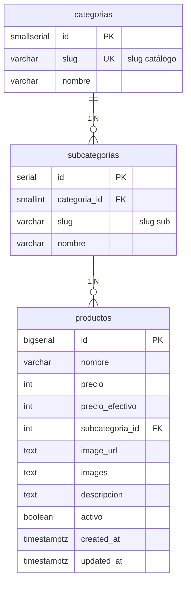

📊 Proyecto de Base de Datos Avanzada  
Grupo 2  

👥 Integrantes  
Conforti, Angelo  
Contreras, Facundo  
Perez, Juan Ignacio  
Romero, Tomas  
Vergara, Juan Ignacio  

📌 Descripción del Proyecto  
Este repositorio contiene el desarrollo del proyecto correspondiente a la materia Base de Datos Avanzada, cuyo objetivo principal es aplicar de forma práctica los conceptos teóricos aprendidos durante el cursado.  

El proyecto busca diseñar, implementar y gestionar una base de datos robusta, eficiente y escalable, incorporando herramientas y técnicas avanzadas del manejo de datos.  

---

🌸 Web Agustina

Sitio web moderno y minimalista desarrollado para AGUSTINA, un emprendimiento de moda femenina. Funciona como catálogo online con panel de administración, integrado con Cloudflare R2 para almacenamiento de imágenes y Cloudflare Workers como backend.

🔗 Demo en vivo: [https://web-agustina.vercel.app/](https://web-agustina.vercel.app/)

✨ Características

- Diseño responsive para móviles, tablets y computadoras
- Catálogo de productos dinámico con filtros por categoría
- Panel de administración para gestión de productos
- Compresión y conversión de imágenes a WebP automática
- Integración con Cloudflare R2 y Workers

---

## Base de datos (PostgreSQL + Sequelize)

El DDL canónico está en `db/schema.sql`. Las migraciones aplican ese archivo para que el esquema y el repo no diverjan.

### Requisitos

- Node.js 18+
- PostgreSQL (p. ej. instancia en Railway)

### Setup (rápido)

1. Copiar variables de entorno a `.env` y pegar `DATABASE_URL` (la que pasó el docente / Railway):
  - **PowerShell:** `Copy-Item .env.example .env`
  - **cmd:** `copy .env.example .env`
  - **bash:** `cp .env.example .env`
2. Si conectan a **Railway desde Windows**, en `.env` dejar `**DATABASE_SSL=true`** (ver la sección *Errores típicos al migrar* más abajo).
3. En la carpeta del repo: `npm install`
4. Aplicar **estructura** (tablas y vista, sin filas de negocio): `npx sequelize-cli db:migrate` (equivalente: `npm run db:migrate`).
5. Cargar **datos** (categorías, subcategorías y productos de experimento): `npx sequelize-cli db:seed:all` (equivalente: `npm run db:seed`). Sin este paso, en Railway las tablas van a existir pero **van a verse vacías**; no es un fallo de la migración.

**Atajo:** `npm run db:setup` hace migrate + seed en un solo comando (útil en una PC nueva con `.env` ya configurado).

Si algo falla: avisar con **captura del error** y **qué paso** estaban haciendo (por ejemplo: “después de `npm install`, al correr migrate”).

### Flujo Git (grupo)

- Trabajar en **rama propia**; integrar en `main` vía **PR** (pull request).
- Mensajes de commit claros, por ejemplo: `feat(seed): …`, `docs(readme): …`, `fix(db): …`.

### Uso de modelos (Node)

```js
const db = require('./db/models');
// db.Categoria, db.Subcategoria, db.Producto, db.sequelize
```

La vista `v_productos_catalogo` existe solo en PostgreSQL; para consultarla con Sequelize usá `db.sequelize.query` con SQL crudo o definí un modelo `sequelize.define` con `tableName: 'v_productos_catalogo'`, `timestamps: false` (opcional).

### Seeds (volumen para EXPLAIN / índices)

Después de `db:migrate`. Hay dos seeders en orden:

1. `20250511140001-seed-catalogo-taxonomia.js` — categorías y subcategorías (slugs alineados al esquema y al admin).
2. `20250511140002-seed-experiment-productos-bulk.js` — muchos productos sintéticos; el `nombre` empieza con `[seed-exp]` para poder borrarlos sin mezclar con datos reales.

**Cantidad de productos:** variable de entorno `SEED_PRODUCT_COUNT` (default **15000**; tope **500000**). `0` omite la inserción masiva. Acordá un `N` razonable para Railway (probar 15k → 50k).

```bash
npx sequelize-cli db:seed:all
npm run db:seed
npm run db:setup   # migrate + seed:all (misma sesión)
```

Con volumen alto (ej. 50k), en **PowerShell:** `$env:SEED_PRODUCT_COUNT=50000; npx sequelize-cli db:seed:all` · **cmd:** `set SEED_PRODUCT_COUNT=50000&& npx sequelize-cli db:seed:all` · **bash:** `SEED_PRODUCT_COUNT=50000 npx sequelize-cli db:seed:all`

Opcional: solo taxonomía — `npx sequelize-cli db:seed --seed 20250511140001-seed-catalogo-taxonomia.js`

Revertir último seed: `npx sequelize-cli db:seed:undo` (repetir para deshacer ambos en orden inverso) o `npm run db:seed:undo` para todos.

Para **volver a cargar solo** el volumen `[seed-exp]` después de haber corrido los dos seeders: `npx sequelize-cli db:seed:undo` (saca el bulk), luego `npx sequelize-cli db:seed --seed 20250511140002-seed-experiment-productos-bulk.js`.

**Atención:** el `down` del seeder de taxonomía borra primero `productos` con nombre `[seed-exp] %` y luego subcategorías/categorías listadas. Si cargaron **productos reales** en esas mismas filas de catálogo, coordinen antes de hacer `db:seed:undo:all`.

Podés documentar `SEED_PRODUCT_COUNT` en `.env` (ver `.env.example`).

**Prompt sugerido (IA):** «Tablas `categorias`, `subcategorias`, `productos` según `db/schema.sql`. Necesito un seeder Sequelize que inserte X filas realistas (slugs, precios, `activo`, `created_at` variado) sin romper FKs. Incluir cómo ejecutarlo con `sequelize-cli db:seed:all`.»

### Errores típicos al migrar


| Síntoma                                                                            | Qué revisar                                                                                                                                                                                  |
| ---------------------------------------------------------------------------------- | -------------------------------------------------------------------------------------------------------------------------------------------------------------------------------------------- |
| `self-signed certificate in certificate chain` / errores TLS al conectar a Railway | En `.env`: `DATABASE_SSL=true`. Si sigue fallando, confirmar que `DATABASE_SSL_REJECT_UNAUTHORIZED` **no** esté en `true` salvo que el docente lo pida.                                      |
| `ECONNREFUSED` / timeout                                                           | `DATABASE_URL` correcta (host/puerto/user/password). Firewall o VPN bloqueando el puerto de Postgres.                                                                                        |
| `password authentication failed`                                                   | Usuario o contraseña de la URL incorrectos; volver a copiar la variable desde Railway.                                                                                                       |
| `Node` no encontrado o paquetes raros                                              | Node **18+** (`node -v`). Borrar `node_modules` y `package-lock.json` solo si acordaron regenerar lock; en general: `npm install` de nuevo.                                                  |
| `relation "categorias" already exists` / migración a medias                        | Alguien ya aplicó el esquema: `npx sequelize-cli db:migrate:status`. Si hace falta revertir en **dev**: `npm run db:migrate:undo` (solo si es seguro; si hay datos, coordinar con el grupo). |
| `DATABASE_URL` vacía o sin pegar                                                   | El archivo debe llamarse `.env` (con punto) y estar en la **raíz** del repo; `DATABASE_URL=` debe tener la URL completa sin comillas.                                                        |
| En Railway las tablas existen pero **están vacías** (0 filas)                    | Es lo esperado si solo corrieron `db:migrate`. La migración crea el esquema; los INSERT van por **seeders**: `npx sequelize-cli db:seed:all` (ver sección *Seeds*). Si `SEED_PRODUCT_COUNT=0`, el bulk de productos se omite pero la taxonomía sí se carga. |


---

## Modelo de datos (PostgreSQL)

El DDL versionado vive en `[db/schema.sql](db/schema.sql)`. Resume el negocio del catálogo **AGUSTINA**: categorías y subcategorías normalizadas, y productos con precios, imágenes, descripción, vigencia (`activo`) y auditoría de fechas. La vista `v_productos_catalogo` proyecta columnas alineadas al JSON que consume el sitio (`name`, `price`, `cat`, `sub`, etc.).

### Diagrama entidad–relación




---

## Informe de rendimiento e índices

### Índices implementados

| Nombre | Tipo | Columnas | Condición parcial | Query cubierta |
|--------|------|----------|-------------------|----------------|
| `idx_productos_subcategoria_id` | B-tree | `subcategoria_id` | — | JOIN FK (creado en schema inicial) |
| `idx_productos_activos` | B-tree parcial | `(subcategoria_id, created_at DESC)` | `WHERE activo = TRUE` | Q1 — catálogo por categoría |
| `idx_productos_created_at_desc` | B-tree | `created_at DESC` | — | Q2 — badge "NUEVO" (últimos 14 días) |

Los índices `idx_productos_activos` e `idx_productos_created_at_desc` se aplican con:

```bash
npx sequelize-cli db:migrate
# aplica 20250520130000-add-catalog-indexes.js
```

### Cómo reproducir los experimentos

Los archivos SQL están en `db/experiments/` y deben ejecutarse en orden:

```
# 1. Verificar entorno (filas, índices existentes, tamaños)
psql $DATABASE_URL -f db/experiments/00_setup.sql

# 2. Capturar planes SIN índices nuevos (baseline)
psql $DATABASE_URL -f db/experiments/01_baseline.sql

# 3. Crear los índices de experimentación
psql $DATABASE_URL -f db/experiments/02_create_indexes.sql

# 4. Capturar planes CON índices — comparar con paso 2
psql $DATABASE_URL -f db/experiments/03_with_indexes.sql

# 5. Auditoría de redundancia y uso de índices (Persona E)
psql $DATABASE_URL -f db/experiments/05_index_audit.sql

# 6. Opcional: volver al estado baseline para repetir
psql $DATABASE_URL -f db/experiments/04_drop_indexes.sql
```

Detalle de cada script: [`db/experiments/README.md`](db/experiments/README.md).  
Informe de optimización y conclusiones de producción: [`informe/seccion_E.md`](informe/seccion_E.md).

> En Windows con Railway, agregar al `.env`: `DATABASE_SSL=true`  
> Antes de correr los EXPLAIN, asegurarse de que el seeder de Persona B ya cargó datos de volumen.

Generar o actualizar `informe/seccion_C.md` (salidas literales + tabla antes/después):

```bash
npm run informe:c
```

### Queries analizadas

| ID | Descripción | Esperado sin índice | Esperado con índice |
|----|-------------|--------------------|--------------------|
| Q1 | Catálogo activo filtrado por categoría, orden por fecha | Seq Scan + Sort | Index Scan / Bitmap Index Scan |
| Q2 | Productos nuevos (últimos 14 días), activos | Seq Scan + Filter + Sort | Index Scan sin Sort extra |
| Q3 | Panel admin: todos los productos con join | Seq Scan + Sort | Sort evitado en parte por `idx_created_at_desc` |


**Notas:** en el DDL, `productos.images` es `text[]` (galería de URLs); el diagrama lo resume como `text` por compatibilidad con Mermaid. Los slugs en `categorias` y `subcategorias` equivalen a los filtros `cat` y `sub` del frontend; la vista `v_productos_catalogo` expone además `name` y `price` a partir de `nombre` y `precio`. Los índices extra para rendimiento se documentan en esta sección, en `db/experiments/` y en `informe/seccion_E.md`.
