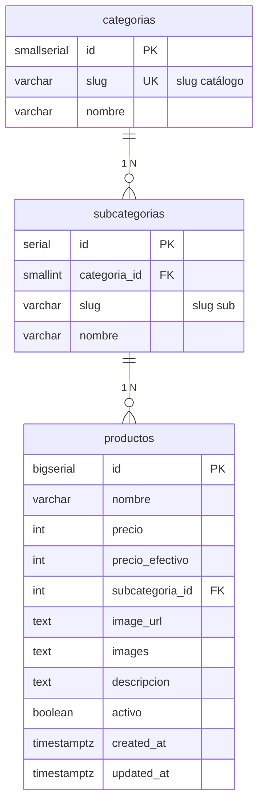

📊 Proyecto de Base de Datos Avanzada  
Grupo 2  

👥 Integrantes  
Conforti, Angelo  
Contreras, Facundo  
Perez, Juan Ignacio  
Romero, Tomas  
Vergara, Juan Ignacio  

📌 Descripción del Proyecto  
Este repositorio contiene el desarrollo del proyecto correspondiente a la materia Base de Datos Avanzada, cuyo objetivo principal es aplicar de forma práctica los conceptos teóricos aprendidos durante el cursado.  

El proyecto busca diseñar, implementar y gestionar una base de datos robusta, eficiente y escalable, incorporando herramientas y técnicas avanzadas del manejo de datos.  

---

🌸 Web Agustina

Sitio web moderno y minimalista desarrollado para AGUSTINA, un emprendimiento de moda femenina. Funciona como catálogo online con panel de administración, integrado con Cloudflare R2 para almacenamiento de imágenes y Cloudflare Workers como backend.

🔗 Demo en vivo: https://web-agustina.vercel.app/

✨ Características
- Diseño responsive para móviles, tablets y computadoras
- Catálogo de productos dinámico con filtros por categoría
- Panel de administración para gestión de productos
- Compresión y conversión de imágenes a WebP automática
- Integración con Cloudflare R2 y Workers

---

## Base de datos (PostgreSQL + Sequelize)

El DDL canónico está en `db/schema.sql`. Las migraciones aplican ese archivo para que el esquema y el repo no diverjan.

### Requisitos

- Node.js 18+
- PostgreSQL (p. ej. instancia en Railway)

### Setup

1. `cp .env.example .env` y pegá `DATABASE_URL` del grupo. Si la conexión es a Railway desde tu máquina, dejá `DATABASE_SSL=true`.
2. `npm install`
3. `npx sequelize-cli db:migrate`

### Uso de modelos (Node)

```js
const db = require('./db/models');
// db.Categoria, db.Subcategoria, db.Producto, db.sequelize
```

La vista `v_productos_catalogo` existe solo en PostgreSQL; para consultarla con Sequelize usá `db.sequelize.query` con SQL crudo o definí un modelo `sequelize.define` con `tableName: 'v_productos_catalogo'`, `timestamps: false` (opcional).

---

## Modelo de datos (PostgreSQL)

El DDL versionado vive en [`db/schema.sql`](db/schema.sql). Resume el negocio del catálogo **AGUSTINA**: categorías y subcategorías normalizadas, y productos con precios, imágenes, descripción, vigencia (`activo`) y auditoría de fechas. La vista `v_productos_catalogo` proyecta columnas alineadas al JSON que consume el sitio (`name`, `price`, `cat`, `sub`, etc.).

### Diagrama entidad–relación



**Notas:** en el DDL, `productos.images` es `text[]` (galería de URLs); el diagrama lo resume como `text` por compatibilidad con Mermaid. Los slugs en `categorias` y `subcategorias` equivalen a los filtros `cat` y `sub` del frontend; la vista `v_productos_catalogo` expone además `name` y `price` a partir de `nombre` y `precio`. Los índices extra para la actividad de rendimiento y `EXPLAIN ANALYZE` se aplican aparte (ver `Actividad_indices.md`).

---

## Persona C — Informe de rendimiento e índices

### Índices implementados

| Nombre | Tipo | Columnas | Condición parcial | Query cubierta |
|--------|------|----------|-------------------|----------------|
| `idx_productos_subcategoria_id` | B-tree | `subcategoria_id` | — | JOIN FK (creado en schema inicial) |
| `idx_productos_activos` | B-tree parcial | `(subcategoria_id, created_at DESC)` | `WHERE activo = TRUE` | Q1 — catálogo por categoría |
| `idx_productos_created_at_desc` | B-tree | `created_at DESC` | — | Q2 — badge "NUEVO" (últimos 14 días) |

Los índices `idx_productos_activos` e `idx_productos_created_at_desc` se aplican con:

```bash
npx sequelize-cli db:migrate
# aplica 20250520130000-add-catalog-indexes.js
```

### Cómo reproducir los experimentos

Los archivos SQL están en `db/experiments/` y deben ejecutarse en orden:

```
# 1. Verificar entorno (filas, índices existentes, tamaños)
psql $DATABASE_URL -f db/experiments/00_setup.sql

# 2. Capturar planes SIN índices nuevos (baseline)
psql $DATABASE_URL -f db/experiments/01_baseline.sql

# 3. Crear los índices de experimentación
psql $DATABASE_URL -f db/experiments/02_create_indexes.sql

# 4. Capturar planes CON índices — comparar con paso 2
psql $DATABASE_URL -f db/experiments/03_with_indexes.sql

# 5. Opcional: volver al estado baseline para repetir
psql $DATABASE_URL -f db/experiments/04_drop_indexes.sql
```

> En Windows con Railway, agregar al `.env`: `DATABASE_SSL=true`  
> Antes de correr los EXPLAIN, asegurarse de que el seeder de Persona B ya cargó datos de volumen.

### Queries analizadas

| ID | Descripción | Esperado sin índice | Esperado con índice |
|----|-------------|--------------------|--------------------|
| Q1 | Catálogo activo filtrado por categoría, orden por fecha | Seq Scan + Sort | Index Scan / Bitmap Index Scan |
| Q2 | Productos nuevos (últimos 14 días), activos | Seq Scan + Filter + Sort | Index Scan sin Sort extra |
| Q3 | Panel admin: todos los productos con join | Seq Scan + Sort | Sort evitado en parte por `idx_created_at_desc` |

