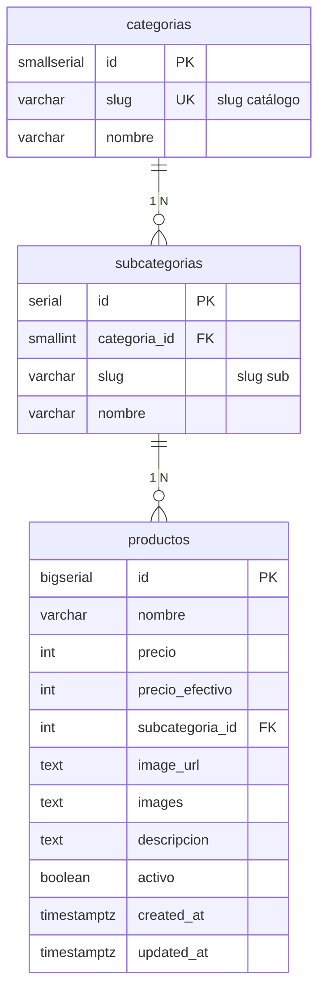

📊 Proyecto de Base de Datos Avanzada  
Grupo 2  

👥 Integrantes  
Conforti, Angelo  
Contreras, Facundo  
Perez, Juan Ignacio  
Romero, Tomas  
Vergara, Juan Ignacio  

📌 Descripción del Proyecto  
Este repositorio contiene el desarrollo del proyecto correspondiente a la materia Base de Datos Avanzada, cuyo objetivo principal es aplicar de forma práctica los conceptos teóricos aprendidos durante el cursado.  

El proyecto busca diseñar, implementar y gestionar una base de datos robusta, eficiente y escalable, incorporando herramientas y técnicas avanzadas del manejo de datos.  

---

🌸 Web Agustina

Sitio web moderno y minimalista desarrollado para AGUSTINA, un emprendimiento de moda femenina. Funciona como catálogo online con panel de administración, integrado con Cloudflare R2 para almacenamiento de imágenes y Cloudflare Workers como backend.

🔗 Demo en vivo: [https://web-agustina.vercel.app/](https://web-agustina.vercel.app/)

✨ Características

- Diseño responsive para móviles, tablets y computadoras
- Catálogo de productos dinámico con filtros por categoría
- Panel de administración para gestión de productos
- Compresión y conversión de imágenes a WebP automática
- Integración con Cloudflare R2 y Workers

---

## Base de datos (PostgreSQL + Sequelize)

El DDL canónico está en `db/schema.sql`. Las migraciones aplican ese archivo para que el esquema y el repo no diverjan.

### Requisitos

- Node.js 18+
- PostgreSQL (p. ej. instancia en Railway)

### Setup (rápido)

1. Copiar variables de entorno a `.env` y pegar `DATABASE_URL` (la que pasó el docente / Railway):
  - **PowerShell:** `Copy-Item .env.example .env`
  - **cmd:** `copy .env.example .env`
  - **bash:** `cp .env.example .env`
2. Si conectan a **Railway desde Windows**, en `.env` dejar `**DATABASE_SSL=true`** (ver la sección *Errores típicos al migrar* más abajo).
3. En la carpeta del repo: `npm install`
4. Aplicar tablas: `npx sequelize-cli db:migrate` (equivalente: `npm run db:migrate`)

Si algo falla: avisar con **captura del error** y **qué paso** estaban haciendo (por ejemplo: “después de `npm install`, al correr migrate”).

### Flujo Git (grupo)

- Trabajar en **rama propia**; integrar en `main` vía **PR** (pull request).
- Mensajes de commit claros, por ejemplo: `feat(seed): …`, `docs(readme): …`, `fix(db): …`.

### Uso de modelos (Node)

```js
const db = require('./db/models');
// db.Categoria, db.Subcategoria, db.Producto, db.sequelize
```

La vista `v_productos_catalogo` existe solo en PostgreSQL; para consultarla con Sequelize usá `db.sequelize.query` con SQL crudo o definí un modelo `sequelize.define` con `tableName: 'v_productos_catalogo'`, `timestamps: false` (opcional).

### Errores típicos al migrar


| Síntoma                                                                            | Qué revisar                                                                                                                                                                                  |
| ---------------------------------------------------------------------------------- | -------------------------------------------------------------------------------------------------------------------------------------------------------------------------------------------- |
| `self-signed certificate in certificate chain` / errores TLS al conectar a Railway | En `.env`: `DATABASE_SSL=true`. Si sigue fallando, confirmar que `DATABASE_SSL_REJECT_UNAUTHORIZED` **no** esté en `true` salvo que el docente lo pida.                                      |
| `ECONNREFUSED` / timeout                                                           | `DATABASE_URL` correcta (host/puerto/user/password). Firewall o VPN bloqueando el puerto de Postgres.                                                                                        |
| `password authentication failed`                                                   | Usuario o contraseña de la URL incorrectos; volver a copiar la variable desde Railway.                                                                                                       |
| `Node` no encontrado o paquetes raros                                              | Node **18+** (`node -v`). Borrar `node_modules` y `package-lock.json` solo si acordaron regenerar lock; en general: `npm install` de nuevo.                                                  |
| `relation "categorias" already exists` / migración a medias                        | Alguien ya aplicó el esquema: `npx sequelize-cli db:migrate:status`. Si hace falta revertir en **dev**: `npm run db:migrate:undo` (solo si es seguro; si hay datos, coordinar con el grupo). |
| `DATABASE_URL` vacía o sin pegar                                                   | El archivo debe llamarse `.env` (con punto) y estar en la **raíz** del repo; `DATABASE_URL=` debe tener la URL completa sin comillas.                                                        |


---

## Modelo de datos (PostgreSQL)

El DDL versionado vive en `[db/schema.sql](db/schema.sql)`. Resume el negocio del catálogo **AGUSTINA**: categorías y subcategorías normalizadas, y productos con precios, imágenes, descripción, vigencia (`activo`) y auditoría de fechas. La vista `v_productos_catalogo` proyecta columnas alineadas al JSON que consume el sitio (`name`, `price`, `cat`, `sub`, etc.).

### Diagrama entidad–relación




**Notas:** en el DDL, `productos.images` es `text[]` (galería de URLs); el diagrama lo resume como `text` por compatibilidad con Mermaid. Los slugs en `categorias` y `subcategorias` equivalen a los filtros `cat` y `sub` del frontend; la vista `v_productos_catalogo` expone además `name` y `price` a partir de `nombre` y `precio`. Los índices extra para la actividad de rendimiento y `EXPLAIN ANALYZE` se aplican aparte (ver `Actividad_indices.md`).